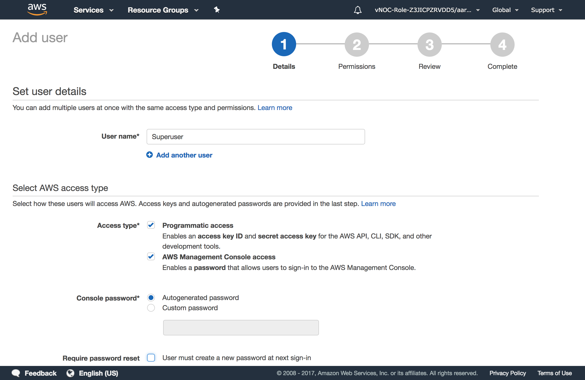

# Week 1 - Setup and IAM

## Goals
- Create a Free Tier AWS account
- Create a SuperUser account
- Create an account with limited rights
- Install AWS CLI tools

## Preperation
 ### Create your Amazon account!
 - https://aws.amazon.com/free/
 ### Install the CLI tools
 - http://docs.aws.amazon.com/cli/latest/userguide/installing.html

### Read some background material
- Learn about Cloud differences
  - Cattle vs Pets: the most critical Meme
    - https://www.slideshare.net/randybias/the-history-of-pets-vs-cattle-and-using-it-properly
    - http://cloudscaling.com/blog/cloud-computing/the-history-of-pets-vs-cattle/

- Amazon IAM
  - Read http://docs.aws.amazon.com/IAM/latest/UserGuide/introduction.html
  - Why it matters: https://gizmodo.com/top-defense-contractor-left-sensitive-pentagon-files-on-1795669632


## Why start with AWS CLI (Command Line Interface)?

In the cloud we need to not care about individual servers or services and treat resources more like cattle and less like pets.  Using the AWS console lets you understand and manage single things, but in order to really benefit from cloud computing you need to use code and scripts to manage infrastructure and applications.  

> In the old way of doing things, we treat our servers like pets, for example Bob the mail server. If Bob goes down, it’s all hands on deck. The CEO can’t get his email and it’s the end of the world. In the new way, servers are numbered, like cattle in a herd. For example, www001 to www100. When one server goes down, it’s taken out back, shot, and replaced on the line. ()

## IAM

> AWS Identity and Access Management (IAM) is a web service that helps you securely control access to AWS resources for your users. You use IAM to control who can use your AWS resources (authentication) and how they can use resources (authorization).

### Concepts:

- An __Account__ partitions __Users__, __Groups__, and __Policies__
- A __User__ can have many __Policies__ attached
- A __User__ can be in multiple __Groups__
- A __Group__ can have many __Policies__ attached
- A __Policy__ *defines* the access 

- __ARN__ is an [Amazon Resource Name](http://docs.aws.amazon.com/general/latest/gr/aws-arns-and-namespaces.html) to identify a particular resource.  __ARNs__ can be users, roles, S3 buckets, accounts.

```
arn:aws:iam::123456789012:user/aheld
arn:aws:sts::123456789012:federated-user/Bob
arn:aws:iam::aws:policy/AdministratorAccess
arn:aws:s3:::nrg_training/README.md
arn:aws:iam::123456789012:role/application_abc/component_xyz/S3Access
arn:aws:ec2:region:account-id:network-acl/nacl-id
arn:aws:ec2:region:account-id:subnet/subnet-id
```


#### Policy

A __Policy__ *defines* the access rights

example: ( [used by defense contractors](https://gizmodo.com/top-defense-contractor-left-sensitive-pentagon-files-on-1795669632) )

Policy to read anything in any S3 bucket
```json
{
    "Version": "2012-10-17",
    "Statement": [
        {
            "Effect": "Allow",
            "Action": [
                "s3:Get*",
                "s3:List*"
            ],
            "Resource": "*"
        }
    ]
}
```

Question:  What do you think the 'Admin' policy looks like?

#### Group

Groups should map to business / team roles.  __Role__ means something different then group in IAM.  A Role is typically temporarily assigned to non-user like an application or externally authenticated user. 

#### User

A User is identified by AWS using either username/password OR access and secret Key.


## Exercises
1. Login with your Root account and create a 'Admin/Superuser account' for daily use.  The Root account is too powerful and should only be used this one time. 
)
2. Logout and Log back in as the Superuser (not account id)
   - Bonus points for aliasing account ID
3. Configure AWS tools for Admin Account
4. Test it by creating a new S3 bucket
- check for exisitng S3 buckets  ```  $> aws s3 ls```
- Create a new bucket ```aws s3api create-bucket --bucket nrg_training --region us-east-1```
  - Note: AWS bucket names are shared across accounts.  Find a unique namespace.
  - Push a file to the bucket ``` $> aws s3 cp README.md s3://nrg_training/README.md```
5. Create a restricted user called restrictedUser with an S3 Policy of List and Read access __only__
6. Add the new user to the aws config as a [second named profile](http://docs.aws.amazon.com/cli/latest/userguide/cli-multiple-profiles.html)
7. Try to create a bucket with the restrictedUser
```aws s3api create-bucket --bucket nrg_training --region us-east-1 --profile restrictedUser```
   - It should fail 
8. Try to [download the file](http://docs.aws.amazon.com/cli/latest/reference/s3/cp.html)
   - It should succeed


## Execution Roles
- Systems have execution roles.  Similar in concept to a windows Service Account, but there is no username associated, just a role.
  - The role has policies attached
[Execution Role](http://docs.aws.amazon.com/IAM/latest/UserGuide/id_roles_create_for-service.html)


## Service Policies
- Policies are not just for users, services can also have policies attached. 
- These are attached to an instance of a service, such as an S3 bucket
[S3 Bucket Policy](http://docs.aws.amazon.com/AmazonS3/latest/dev/using-iam-policies.html)

```json
{
  "Version": "2012-10-17",
  "Id": "S3PolicyId1",
  "Statement": [
    {
      "Sid": "IPAllow",
      "Effect": "Allow",
      "Principal": "*",
      "Action": "s3:*",
      "Resource": "arn:aws:s3:::examplebucket/*",
      "Condition": {
         "IpAddress": {"aws:SourceIp": "54.240.143.0/24"},
         "NotIpAddress": {"aws:SourceIp": "54.240.143.188/32"} 
      } 
    } 
  ]
}
```

Roles 