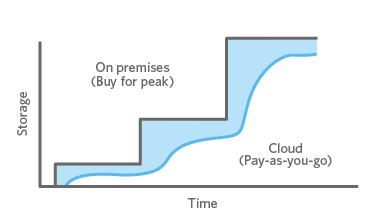

# Week 2 - S3

## Goals
- Understand Simple Storage Service
- Understand costs and storage options
- Create a bucket
- Create a static website using only S3

## Preperation
 ### Complete Week 1!
  - [Week 1 README.md](../Week1/README.md)
 
### S3 Overview
- S3 Intro
  - Object store vs Filesystem
  - Pay as you go 
- S3 Concepts
  - [Bucket Limitations](http://docs.aws.amazon.com/AmazonS3/latest/dev/BucketRestrictions.html)
    - DNS naming conventions
    - 3 to 63 characters
  - It is NOT a website, [but it can be](http://docs.aws.amazon.com/AmazonS3/latest/dev/ManagingBucketWebsiteConfig.html) 
  - [Storage Classes](
http://docs.aws.amazon.com/AmazonS3/latest/dev/storage-class-intro.html)
    - __Standard__ 99.999999999% & 99.99%
    - __Standard - Infrequest Access__ 99.999999999% & __99.9%__
    - __Glacier__ - Same as Standard with a delay to access a file
    - __Reduced Redunadancy__ 99.99% & 99.99%
  - Governance includes [access](http://docs.aws.amazon.com/AmazonS3/latest/dev/cloudtrail-logging.html) and [inventory](http://docs.aws.amazon.com/AmazonS3/latest/dev/storage-inventory.html) reporting, but not by default.
  - __Pricing__ should be reviewed based on use cases: https://aws.amazon.com/s3/pricing/
    - You pay for everything. reads, writes, data tranfer and storage per month.
    - Generally it is cost effective, but not always.  Other AWS services, from Redshift to DynamoDB may be better options.


## Exercises

### Archive / Usage Data
1. Login with your Admin account and create a new bucket for storing data and logs
2. Decide on a directory structure for BGE data
 - it is not a directory, it is a URL like filepath
 - Event based ETL
 - use metadata for 'ETL'? 
   - __NEVER COPY or MOVE FILES AGAIN__
3. Trigger an email when a new file is put in place
  - Brief review of SNS, but the topic policy needs something like this:
  ```
  "Resource": "arn:aws:sns:us-east-1:254372949584:newBGEFile",
      "Condition": {
        "ArnLike": {
          "aws:SourceArn": "arn:aws:s3:*:*:nrg-train-archive"
        }
      }
```

### Website
1. Create a new bucket for hosting website content
2. Upload README.md
 - It should not be readable by default
 - a browser will likely not be able to view it
 - set metadata Content-Type: to text/plain
3. make a 'developer' role with write access to this bucket
 - assert that restrictedUser can't write to it
 


